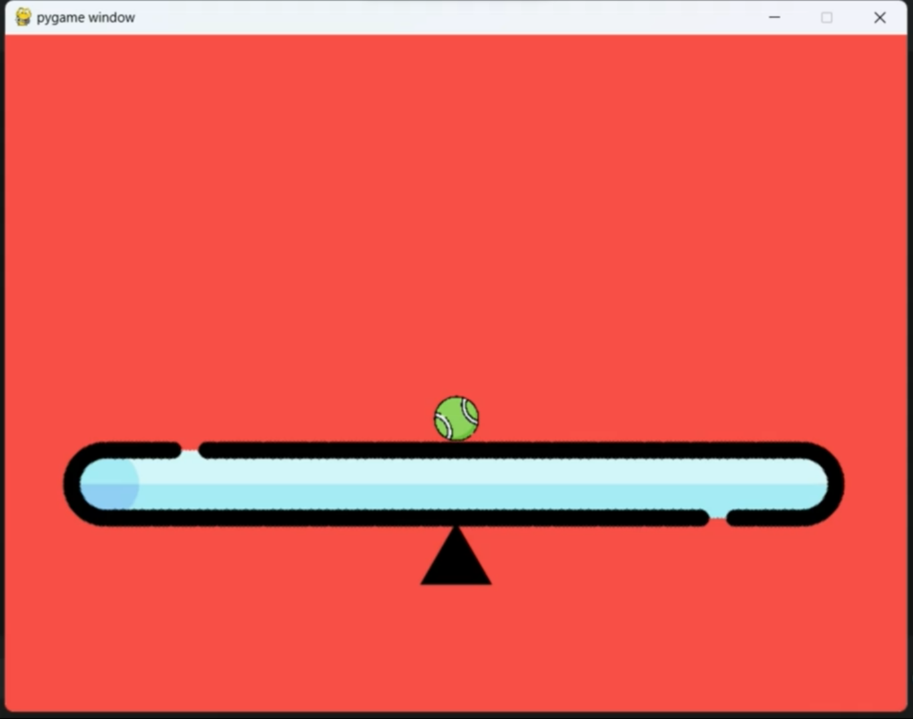

# Assignment #1 of Control Theory Bootcamp 

The filed python files contain the solution code in **Python** to the problem of simulating a controlled model of **Ball-on-a-plate** on _Pygame_, as stated here in the [Problem Statement](Prob_statement.md).
## Ball on a Plate

### My Approach of Attempt
With the help of a module [Control.py](Control.py) created in *Python* and other modules (`NumPy`, `SciPy` and `Pygame`), we build a ***PID controller*** in [main.py](main.py) to  control the movement of the plate to ensure the ball reach  the point set as input via the mouse-click.

With appropriate initialisations and setting up of the  environment in [main.py](main.py), the starting window of Pygame is coded to appear like this, ready to accept the input coordinates.



In the while-loop named as `Game Loop` of [main.py](main.py) (Line **76** onwards), the code continuously checks for mouse inputs using a nested for-loop (Lines **80-88**) that contains an if-else ladder to check and respond for the input mouse-click using functions 
`pygame.MOUSEBUTTONDOWN` and `pygame.MOUSEMOTION`.
Using these X and Y coordinates, we calculate the _error_ (difference between current ball position and setpoint) which is further used for computing the new plate angle using the PID controller as coded in the function block `ctrl_Output`.

I have regulated the PID controller constants as follows:
> - Kp = 0.1   &emsp;&emsp;&emsp;&emsp;&emsp;&emsp; (Proportional gain) 
> - Ki = 0.01   &emsp;&emsp;&emsp;&emsp;&emsp;&emsp; (Integral gain)  
> - Kd = 0.05   &emsp;&emsp;&emsp;&emsp;&emsp;&emsp;(Derivative gain)

Angular velocity of the plate has been capped using the saturation limit to be 1 degree per time-step using the following block of code:
```python
# Constants for the angular velocity saturation
max_dtheta = 1  # degree per time step
# Apply saturation limits
if abs(dtheta) > max_dtheta:
    dtheta = np.sign(dtheta) * max_dtheta
theta += dtheta
```

Now, solving for the new coordinates of the ball, we use `c.solve()` from the imported module [Control.py](Control.py). The change in x is computed by solving the given ordinary differential equation that governs our plant:
$$\ddot{x} = -\frac{5g}{7}\theta$$

using the `odeint` function imported from `SciPy.integrate`.

The time-points I have adjusted for integration is as follows:
> Step-size = 100 in a time-range of 0 to 1
